# Tranzact - Transaction Viewer

<div align="center">
  
  <br><br>
</div>

## 📱 Project Overview

**Tranzact** is a secure financial transaction management Android application that integrates with a transaction API, implements biometric authentication, and provides an intuitive user interface.

### ✨ Key Features

- **🔐 Secure Authentication**: Login system with API integration
- **👆 Biometric Authentication**: Fingerprint login for returning users
- **💰 Transaction Management**: View, search, and filter transactions
- **📊 Budget Analysis**: Visual representation of spending patterns
- **🔄 Offline Mode**: Access transaction data without internet connection
- **🌙 Dark Mode**: Eye-friendly interface option
- **🔒 Secure Token Handling**: Using EncryptedSharedPreferences

---

## 🧩 App Structure

```
com.example.transactionviewer/
├── activities/
│   ├── LoginActivity.java
│   ├── MainActivity.java
│   └── SplashActivity.java
├── adapter/
│   ├── CategoryLegendAdapter.java
│   └── TransactionAdapter.java
├── api/
│   ├── ApiClient.java
│   └── ApiService.java
├── database/
│   ├── AppDatabase.java
│   ├── TransactionDao.java
│   ├── TransactionEntity.java
│   ├── TransactionRepository.java
│   ├── UserProfileDao.java
│   ├── UserProfileEntity.java
│   └── UserProfileRepository.java
├── model/
│   ├── CategoryLegendItem.java
│   ├── LoginRequest.java
│   ├── LoginResponse.java
│   └── Transaction.java
├── security/
│   ├── BiometricHelper.java
│   └── TokenManager.java
├── ui/
│   ├── AnalysisFragment.java
│   ├── ProfileFragment.java
│   └── TransactionFragment.java
└── util/
    └── NetworkUtil.java
```

---

## 📸 Screenshots
<div align="center"> 
  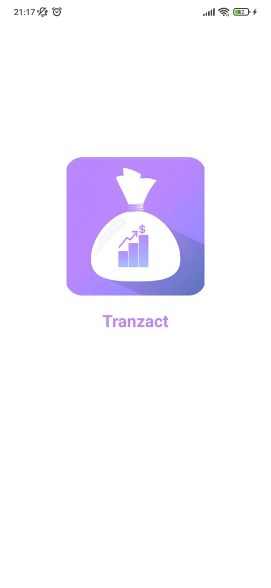 
  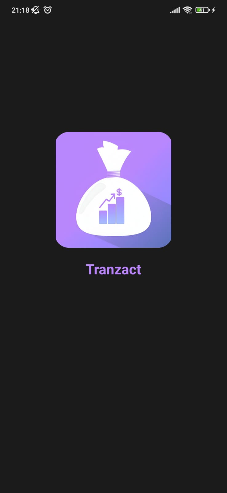 
  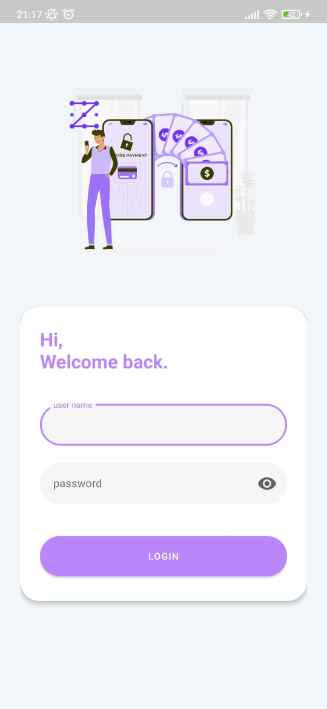 
  <br><br> 
  
  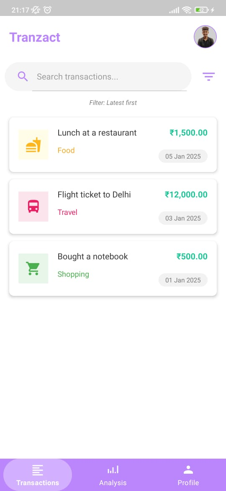 
  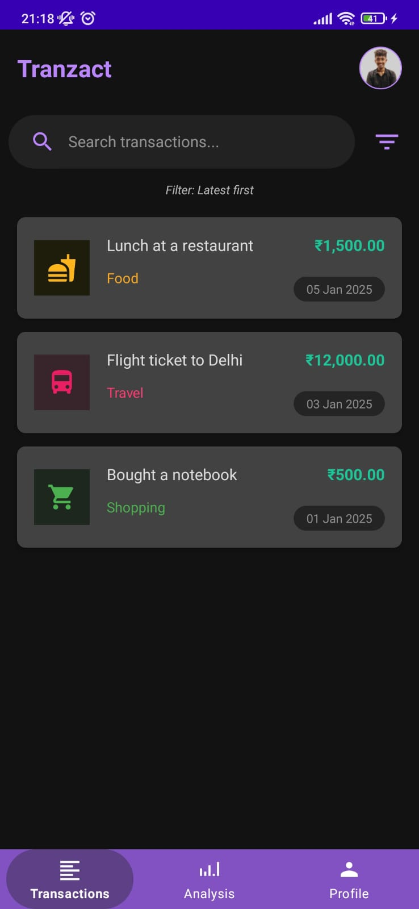 
  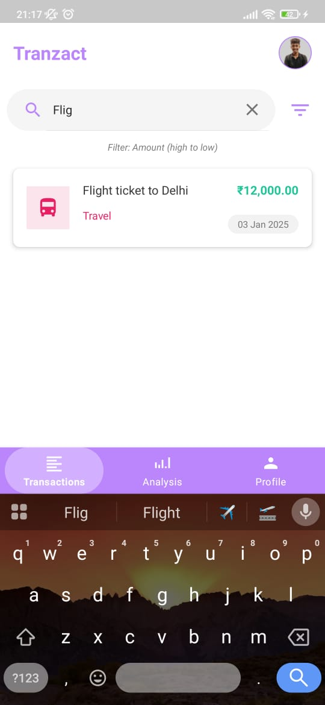 
  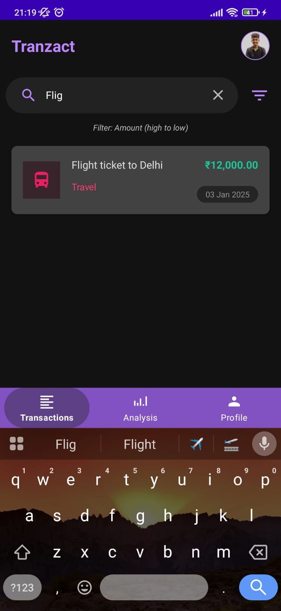<br><br> 
  
  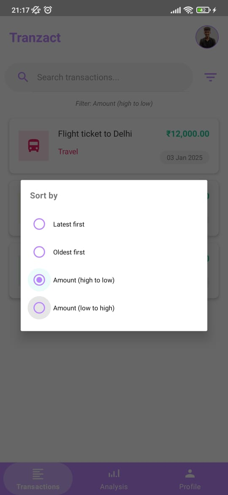 
  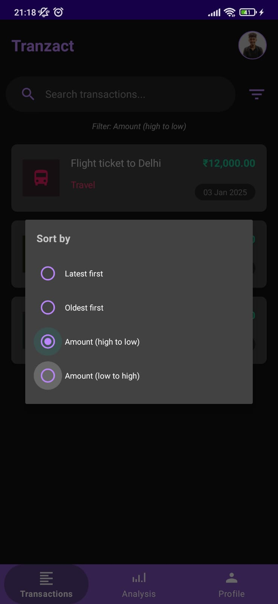 
  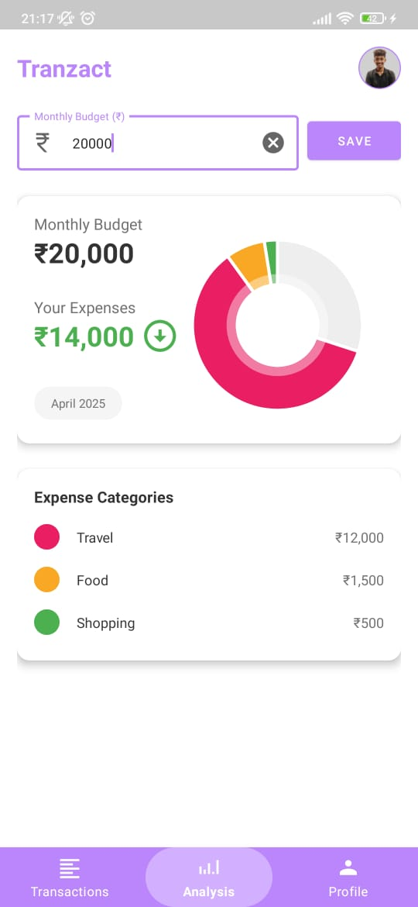 
  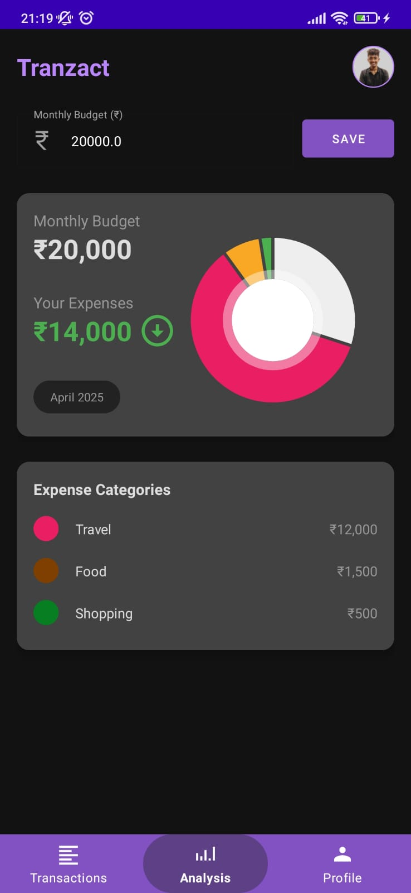<br><br> 
  
  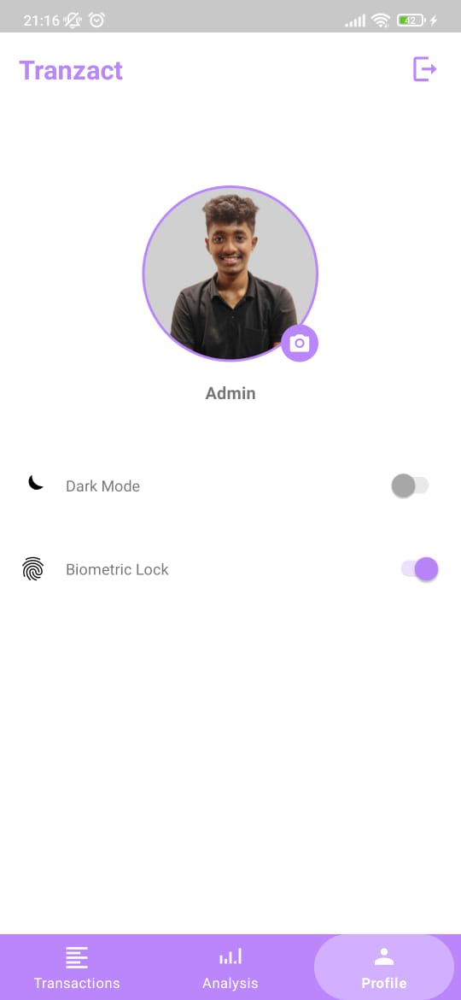 
  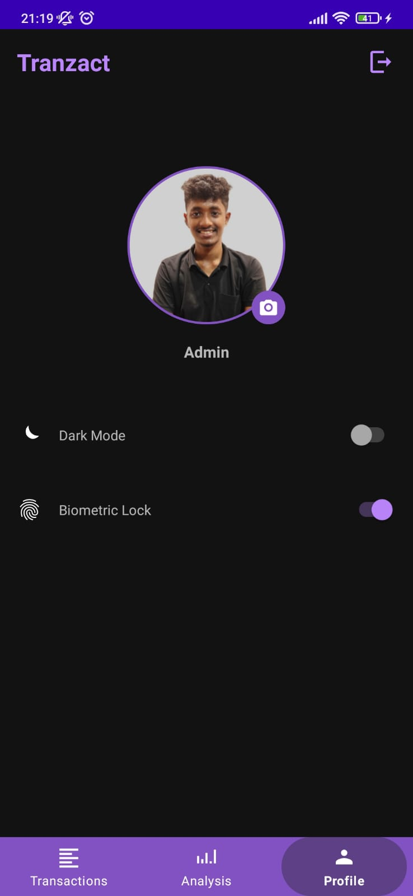 
  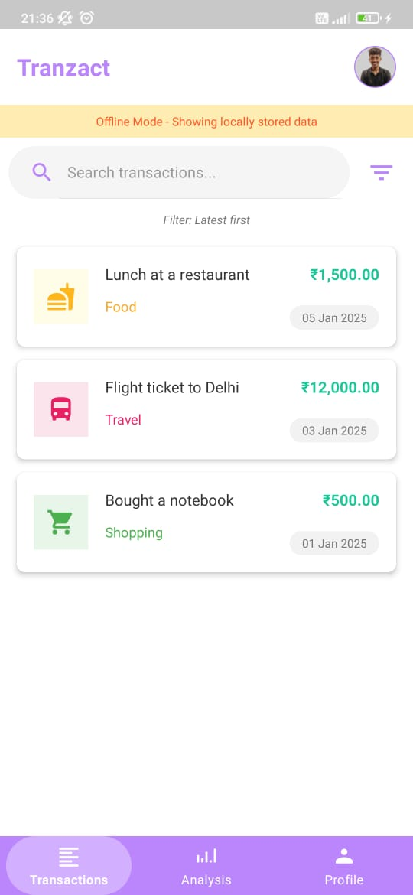 
  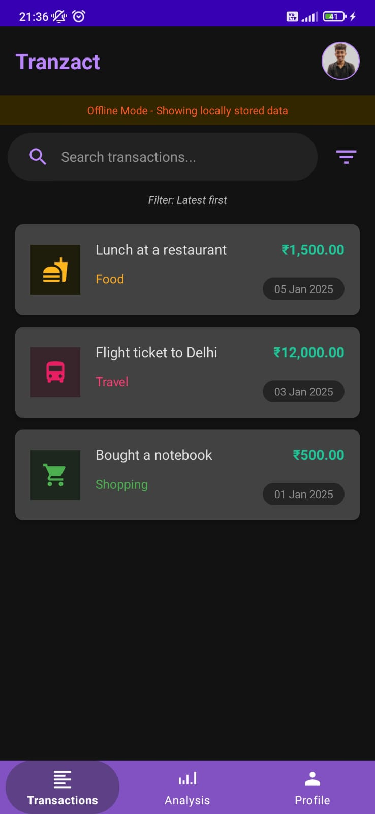 
</div>


---

## 🛠️ Setup Instructions

### Prerequisites

- ✅ Android Studio Arctic Fox (2021.3.1) or newer
- ✅ JDK 11 or newer
- ✅ Android SDK with minimum API level 21 (Android 5.0 - Lollipop)
- ✅ Android device or emulator with fingerprint sensor capabilities

### Clone the Repository

```bash
git clone https://github.com/Rishi2419/Task1-api-transactions
cd task1-api-transactions
```

### API Configuration

The application connects to `https://api.prepstripe.com/` for authentication and transaction data. No additional API keys are required.

### Database Setup

The Room database is automatically created on first application launch. No additional setup is required.

---

## 📦 Build Instructions

### Debug Build

1. Open the project in Android Studio
2. Connect an Android device or start an emulator
3. Click on the "Run" button (▶️) or press Shift+F10
4. Select the target device and click "OK"

### Release Build

<details>
<summary><b>📱 Generate a signed APK</b></summary>
<br>

1. In Android Studio, go to Build → Generate Signed Bundle/APK
2. Select APK
3. Create a new keystore or use an existing one:
   - If creating new, fill out the required fields and remember your password
   - If using existing, browse to your keystore location and enter the password
4. Click Next
5. Select "release" build variant
6. Check both V1 and V2 Signature Versions
7. Click Finish

The signed APK will be generated in `app/release/app-release.apk`
</details>

### Creating GitHub Release

<details>
<summary><b>🚀 Publish your release</b></summary>
<br>

1. Create a tag for your release:
   ```bash
   git tag -a v1.0.0 -m "Version 1.0.0"
   git push origin v1.0.0
   ```

2. Go to your GitHub repository
3. Click on "Releases" in the right sidebar
4. Click "Create a new release"
5. Select the tag you just created
6. Add a title and description for your release
7. Drag and drop your APK file (`app/release/app-release.apk`)
8. Click "Publish release"
</details>

---

## 📝 Usage Guide

### First Launch

1. Upon first launch, you will see the splash screen with the Tranzact logo
2. You will be directed to the login screen
3. Enter your username and password
4. Tap "LOGIN" to authenticate

### Subsequent Launches

1. The app will prompt for biometric authentication
2. Use your fingerprint to unlock the application
3. Alternatively, you can switch back to password login

### Features

<details>
<summary><b>💸 Transactions Tab</b></summary>
<br>

- View all your transactions
- Search transactions using the search bar
- Filter transactions by amount or date
- View transaction details
</details>

<details>
<summary><b>📈 Analysis Tab</b></summary>
<br>

- Set monthly budget
- Monitor expenses by category
- View spending distribution in pie chart
</details>

<details>
<summary><b>👤 Profile Tab</b></summary>
<br>

- Toggle Dark Mode
- Enable/Disable Biometric Lock
- Set profile picture
- Sign out
</details>

---

## 🎯 Bonus Features Implemented

<table>
  <tr>
    <td width="50%">
      <b>🌙 Dark Mode</b><br>
      Toggle between light and dark themes from the Profile screen
    </td>
    <td width="50%">
      <b>🔄 Offline Mode</b><br>
      Transactions are cached using Room Database and available offline with a banner notification
    </td>
  </tr>
  <tr>
    <td width="50%">
      <b>🔍 Search/Filter Functionality</b><br>
      Search transactions by name and filter by various criteria (Latest first, Oldest first, Amount high to low, Amount low to high)
    </td>
    <td width="50%">
      <b>📊 Budget Analysis</b><br>
      Visual representation of spending with interactive charts using MPAndroidChart
    </td>
  </tr>
  <tr>
    <td colspan="2">
      <b>🖼️ Profile Picture</b><br>
      User can set and view their profile image
    </td>
  </tr>
</table>

---

## 🔧 Technical Details

### Security Implementation

- **Token Storage**: Secure token storage using EncryptedSharedPreferences
- **Biometric Authentication**: Implemented using BiometricPrompt API
- **Network Security**: HTTPS connections with certificate pinning

### Libraries Used

| Library | Purpose |
|---------|---------|
| **Retrofit** | API integration |
| **Room** | Local database management |
| **MPAndroidChart** | Data visualization |
| **Glide** | Image loading and caching |
| **Material Components** | UI elements |

---

## ❓ Troubleshooting

### Common Issues

- **Biometric Authentication Not Working**: Ensure your device has fingerprint capabilities and you have enrolled at least one fingerprint
- **Offline Mode Not Syncing**: Check your internet connection and try refreshing the transactions screen
- **API Connection Errors**: Verify your internet connection and try again

---

## 📄 License

This project is licensed under the MIT License - see the LICENSE file for details.

---

## 📞 Contact

For questions or support, please contact [your-email@example.com](mailto:sahurishikesh1908@gmail.com)
